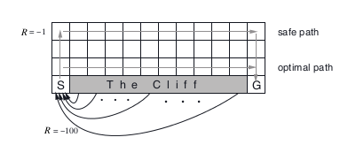

### Understand Actor-Critic (AC) algorithms
 - Learned Value Function
 - Learned Policy 
 
Monte Carlo Policy Gradient sill has high variance so critic estimates the action-value function
 - critic updates action-value function parameters w
 - actor updates policy parameter


### `Example cliff-walk with Actor-Critic algo`

> The cliff-walking task. The results are from a single run, but smoothed by averaging the reward sums from 10 successive episodes.



```python
from lib.envs.cliff_walking import CliffWalkingEnv 
#this example test cliff walking
from lib import plotting

#create openai gym 
env = CliffWalkingEnv()

```

```python
# CliffWalking Environment
class CliffWalkingEnv(discrete.DiscreteEnv):
	
    metadata = {'render.modes': ['human', 'ansi']}

    def __init__(self):
    	# maze size is 4 X 12 matrix
        self.shape = (4, 12)
        # np.prod => Return the product of array elements over a given axis.
        nS = np.prod(self.shape) # nS => 4*12 
        nA = 4

        # Cliff Location
        self._cliff = np.zeros(self.shape, dtype=np.bool)
        self._cliff[3, 1:-1] = True # cliff postion 

        # Calculate transition probabilities
        P = {}
        for s in range(nS):
            # Converts a flat index or array of flat indices
            # into a tuple of coordinate arrays.
            # s = 47 , temp_shape = (4 ,12)
            # position = np.unravel_index(s, temp_shape)
            # position = (3 ,11)
            position = np.unravel_index(s, self.shape)
            P[s] = { a : [] for a in range(nA) }
            P[s][UP] = self._calculate_transition_prob(position, [-1, 0])
            P[s][RIGHT] = self._calculate_transition_prob(position, [0, 1])
            P[s][DOWN] = self._calculate_transition_prob(position, [1, 0])
            P[s][LEFT] = self._calculate_transition_prob(position, [0, -1])

        # We always start in state (3, 0)
        isd = np.zeros(nS)
        isd[np.ravel_multi_index((3,0), self.shape)] = 1.0

        super(CliffWalkingEnv, self).__init__(nS, nA, P, isd)
```

```python
# reset tensor flow graph 
tf.reset_default_graph()

# non-trainable, global step tensorflow variable
global_step = tf.Variable(0, name="global_step", trainable=False)
# create Policy Estimator => actor
policy_estimator = PolicyEstimator()
# create Value Estimator => critic 
value_estimator = ValueEstimator()

with tf.Session() as sess:
    # initialize tensorflow session variables
    sess.run(tf.initialize_all_variables())
    # Note, due to randomness in the policy the number of episodes 
    # you need to learn a good policy may vary. ~300 seemed to work well for me.
    stats = actor_critic(env, policy_estimator, value_estimator, 300)
```

```python
def actor_critic(env, estimator_policy, estimator_value, num_episodes, discount_factor=1.0):
    """
    Actor Critic Algorithm. Optimizes the policy 
    function approximator using policy gradient.
    
    Args:
        env: OpenAI environment. => class CliffWalkingEnv
        estimator_policy: Policy Function to be optimized 
        estimator_value: Value function approximator, used as a critic
        num_episodes: Number of episodes to run for
        discount_factor: Time-discount factor
    
    Returns:
        An EpisodeStats object with two numpy arrays for episode_lengths
        and episode_rewards.
    """

    # Keeps track of useful statistics
    stats = plotting.EpisodeStats(
        episode_lengths=np.zeros(num_episodes),
        episode_rewards=np.zeros(num_episodes))    
    '''
    >>> # collections.namedtuple Basic example
    >>> Point = namedtuple('Point', ['x', 'y'])
    >>> p = Point(11, y=22)     # instantiate with positional or keyword arguments
    >>> p[0] + p[1]             # indexable like the plain tuple (11, 22)
    33
    >>> x, y = p                # unpack like a regular tuple
    >>> x, y
    (11, 22)
    >>> p.x + p.y               # fields also accessible by name
    33
    >>> p                       # readable __repr__ with a name=value style
    Point(x=11, y=22)
    '''
    Transition = collections.namedtuple("Transition", ["state", "action", "reward",
     "next_state", "done"])
    '''
     t = Transition(state=state, action=action, reward=reward, next_state=next_state,
     done=done)
     t.state, t.action
    '''
    for i_episode in range(num_episodes):
        # Reset the environment and pick the fisrst action
        state = env.reset()
        
        episode = []
        
        # One step in the environment
        for t in itertools.count():
            
            # Take a step
            action_probs = estimator_policy.predict(state)
            action = np.random.choice(np.arange(len(action_probs)), p=action_probs)
            next_state, reward, done, _ = env.step(action)
            
            # Keep track of the transition
            episode.append(Transition(
              state=state, action=action, reward=reward, next_state=next_state, done=done))
            
            # Update statistics
            stats.episode_rewards[i_episode] += reward
            stats.episode_lengths[i_episode] = t
            
            # Calculate TD Target
            value_next = estimator_value.predict(next_state)
            td_target = reward + discount_factor * value_next
            td_error = td_target - estimator_value.predict(state)
            
            # Update the value estimator
            estimator_value.update(state, td_target)
            
            # Update the policy estimator
            # using the td error as our advantage estimate
            estimator_policy.update(state, td_error, action)
            
            # Print out which step we're on, useful for debugging.
            print("\rStep {} @ Episode {}/{} ({})".format(
                    t, i_episode + 1, num_episodes, stats.episode_rewards[i_episode - 1]), end="")

            if done:
                break
                
            state = next_state
    
    return stats
```